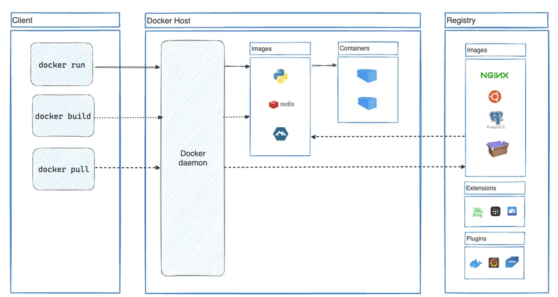
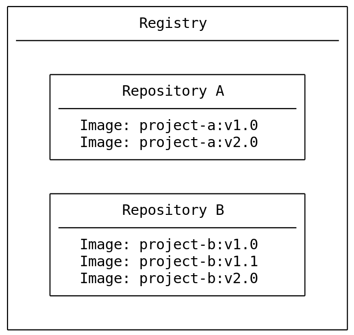
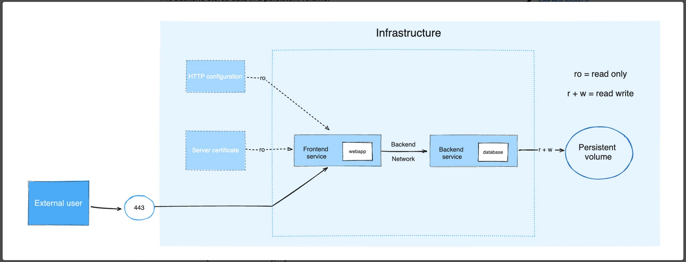
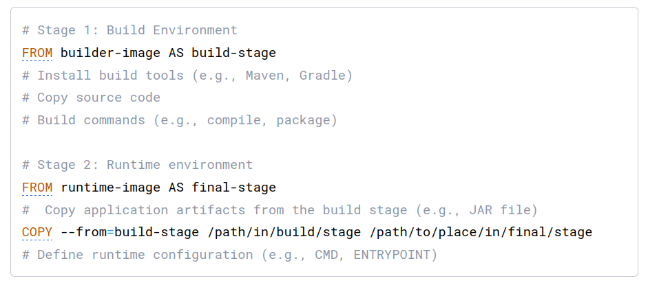

## Docker Report

**1. What is Docker**

- An open platform for developing, shipping, and running applications.

- Separate applications from infrastructure so can deliver software quickly.

- Provides the ability to package and run an application in a loosely isolated environment called a container.

- Lightweight and fast.

**2. Docker architecture**

- `"Docker daemon"`: listens Docker API requests and manages Docker objects such as images, containers, networks, and volumes.

- `"Docker client"`: interact with Docker.

  - E.g: Docker Compose

- `"Docker registries"`: stores Docker images.
  - E.g: Docker Hub

**3. Docker objects**

- `"image"`:

  - read-only template with instructions for creating a Docker container.
  - each instruction in a Dockerfile creates a layer in image. When has a change in the Dockerfile => rebuild => only layers changed rebuilt => images lightweight, fast

- `"container"`:
  - instance of image
  - By default, containers can connect to external networks using the host machine's network connection.

> Docker uses a technology called **namespaces** to provide the isolated workspace called the container. When a container is run, Docker creates a set of namespaces for that container.

**4. Docker versus VM**

- `"VM"` is an entire operating system with its own kernel, hardware drivers, programs, and applications.
- `"Container"` is simply an isolated process with all of the files it needs to run.

  > If multiple containers are run, they all share the same kernel => run more applications on less infrastructure.

**5. Registry vs repository**

- `"registry"` is a centralized location that stores and manages container images.
- `"repository"` is a collection of related container images within a registry.

**6. Docker Compose**

- A tool for defining and running multi-container applications.
- Provides a way to document and configure all of the application's service dependencies (databases, queues, caches, web service APIs, etc).

**7. Building images**

- `"Image layers"`:

  - Each layer contains a set of filesystem changes - additions, deletions, or modifications.

  > docker image history
  > docker container commit

- `"Common instructions"`:

  - FROM `<image>` - this specifies the base image that the build will extend.
  - WORKDIR `<path>` - this instruction specifies the "working directory" or the path in the image where files will be copied and commands will be executed.
  - COPY `<host-path>` `<image-path>` - this instruction tells the builder to copy files from the host and put them into the container image.
  - RUN `<command>` - this instruction tells the builder to run the specified command.
  - ENV `<name>` `<value>` - this instruction sets an environment variable that a running container will use.
  - EXPOSE `<port-number>` - this instruction sets configuration on the image that indicates a port the image would like to expose.
  - USER `<user-or-uid>` - this instruction sets the default user for all subsequent instructions.
  - CMD `["<command>", "<arg1>"]` - this instruction sets the default command a container using this image will run.

- `"Multi-stage builds"`:

  
