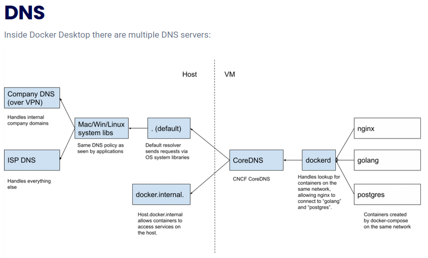
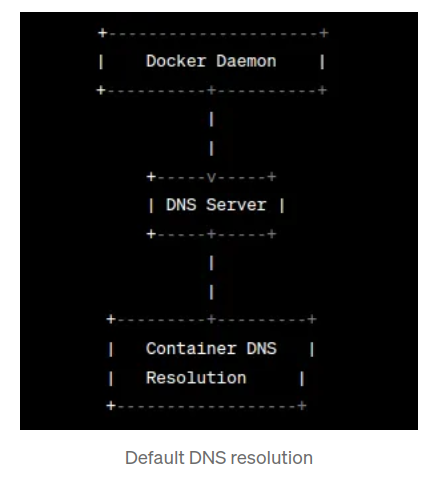

<!-- Containers have networking enabled by default, and they can make outgoing connections. A container has no information about what kind of network it's attached to, or whether their peers are also Docker workloads or not. A container only sees a network interface with an IP address, a gateway, a routing table, DNS services, and other networking details. That is, unless the container uses the none network driver.

bridge The default network driver.

By default, when you create or run a container using docker create or docker run, containers on bridge networks don't expose any ports to the outside world.

Publishing container ports is insecure by default. Meaning, when you publish a container's ports it becomes available not only to the Docker host, but to the outside world as well.

If you want to make a container accessible to other containers, it isn't necessary to publish the container's ports. You can enable inter-container communication by connecting the containers to the same network, usually a bridge network.

By default, the container gets an IP address for every Docker network it attaches to. A container receives an IP address out of the IP subnet of the network. The Docker daemon performs dynamic subnetting and IP address allocation for containers.

In the same way, a container's hostname defaults to be the container's ID in Docker. You can override the hostname using --hostname. When connecting to an existing network using docker network connect, you can use the --alias flag to specify an additional network alias for the container on that network.

Containers use the same DNS servers as the host by default

By default, containers inherit the DNS settings as defined in the /etc/resolv.conf configuration file. Containers that attach to the default bridge network receive a copy of this file. Containers that attach to a custom network use Docker's embedded DNS server.

The embedded DNS server forwards external DNS lookups to the DNS servers configured on the host.

By default, for both IPv4 and IPv6, the daemon blocks access to ports that have not been published. Published container ports are mapped to host IP addresses.

In terms of Docker, a bridge network uses a software bridge which lets containers connected to the same bridge network communicate, while providing isolation from containers that aren't connected to that bridge network.

Bridge networks apply to containers running on the same Docker daemon host.

For communication among containers running on different Docker daemon hosts, you can either manage routing at the OS level, or you can use an overlay network.

When you start Docker, a default bridge network (also called bridge) is created automatically, and newly-started containers connect to it unless otherwise specified.

User-defined bridges provide automatic DNS resolution between containers.

Containers on the default bridge network can only access each other by IP addresses, unless you use the --link option, which is considered legacy. On a user-defined bridge network, containers can resolve each other by name or alias. -->

<!-- Containers connected to the same user-defined bridge network effectively expose all ports to each other. For a port to be accessible to containers or non-Docker hosts on different networks, that port must be published using the -p or --publish flag. -->
<!-- ## DNS trong Docker

Docker sử dụng DNS internal server cho các container kết nối vào cùng một mạng user-defined (bridge). Docker tự động tạo các mục DNS để cho phép chúng giao tiếp với nhau bằng tên service. DNS internal server này mapping tên container đến địa chỉ IP tương ứng, => không cần sử dụng địa chỉ IP.

### Cách hoạt động của DNS trong Docker

1. **User-defined**: Trong một mạng bridge, các container được tách biệt với các container trong các mạng khác. Docker engine chạy một DNS internal server để mapping tên container đến các địa chỉ IP. Khi một container cố gắng truy cập một container khác bằng tên service của nó, DNS server resolve tên container => địa chỉ IP.
2. **Bridge Networks**: Mạng bridge là mạng mặc định được Docker tạo ra. Khi các container được kết nối vào một mạng user-defined, Docker sẽ tự động quản lý các địa chỉ IP và các mục DNS.

### Đặc điểm của mạng Bridge:

- **Địa chỉ IP của Container**: Mỗi container trong một mạng bridge đều được cấp phát một địa chỉ IP nội bộ.
- **Seperate network**: Các container trên mạng bridge không thể giao tiếp với các container trên các mạng khác.

### Resolution Service name trong Docker Compose

Khi sử dụng Docker Compose, các container có thể giao tiếp với nhau bằng tên service như các mục DNS. Docker Compose tự động thiết lập việc resolution DNS, mapping tên service đến các địa chỉ IP của container.

### Tại sao Service name hoạt động được

Khi tất cả các service được định nghĩa trong cùng một file Docker Compose và được kết nối vào một mạng chung, Docker quản lý các mục DNS cho mỗi service. Các mục DNS này mapping tên service đến các địa chỉ IP của container tương ứng.

### Tại sao cấu hình có thể khác nhau dối với một số Service

1. **Sử dụng địa chỉ IP**: Trong các trường hợp mà các container nằm trên các mạng riêng biệt, resolution internal DNS không hỗ trợ giao tiếp giữa các mạng đó. Do đó, các container cần được truy cập bằng địa chỉ IP cụ thể của chúng.
2. **Sử dụng tên service**: Khi các container nằm trong cùng một file Docker Compose và được kết nối vào một mạng chung, Docker sẽ tự động resolution tên container thành các địa chỉ IP nội bộ. -->

### Tại sao trong cùng một docker compose file các container có thể communicate via service name

- Docker sử dụng built-in DNS service: DNS service maps IP address => aliases
- Đầu tiên Docker gán IP cho mỗi container như DHCP server
- Containers process DNS requests via docker daemon, dockerd sẽ nhận ra container name on the same internal network => communicate without internal IP address.
- DNS resolution is process: domain name => IP address

### Tại sao khi các container on the different network muốn communicate via IP address + host's port

- Do các container hoàn toàn tách biệt không cùng một DNS server => không thể resolve container name
- Sử dụng cơ chế NAT và port forwarding : `<IP-host>`:port-mapping ~ `<IP-container>`:port-expose

### Tại sao phải expose port

- Việc expose port là cần thiết khi muốn cho phép các container bên ngoài truy cập vào dịch vụ của container thông qua host's port.
- Nếu chỉ giao tiếp giữa các container trong cùng một mạng, không cần phải expose ports.

---

## What is DNS? | How DNS works (Traditional Network)

- DNS translate domain names => IP addresses => browsers can load internet resources
- DNS resolution: converting a hostname (www.example.com) => IP address (192.168.1.1)
- DNS servers: DNS recursor, Root nameserver, TLD nameserver, Auhtoritative nameserver

**1. DNS recursor(recursive resolver)**

- a server receive queries from client machines
- the recursive resolver will cache information received from authoritative nameservers
- IP address of a domain name that was recently requested => the resolver just deliver the client the record from cache => without communicate with the nameservers

**2. Root nameserver**

- receive queries from DNS recursor => then directing to TLD nameserver based on top-level domain(.com, .net, etc)

**3. TLD nameserver**

- maintains information for all the domain name share a common domain extension (.com, .net, etc)
- directing to Authoritative nameserver

**4. Authoritative nameserver**

- contains information specific to the domain name
- provide DNS recursor IP address if it has access to the requested record

**5. The 8 steps in a DNS lookup**

1. User types "www.example.com" into web browser => query travels into the Internet => DNS recursive resolver

2. DNS recursor => query to Root nameserver

3. Root namserver => respond to the DNS recursor top-level domain (.com)

4. DNS recursor => .com TLD nameserver

5. TLD nameserver => respond IP address of the domain's nameserver, example.com to the DNS recursor

6. DNS recursor => query to the domain's nameserver

7. The domain's nameserver => respond IP address for "example.com" to DNS recursor

8. DNS recursor => responds to web browser with IP address

## What is ISP?

- ISP (Internet Service Provider) : an Internet Access Provider or an online service provider
- Types of ISP Connections
  - DSL
  - WiFi broadband
  - mobile broadband
  - fibre optic broadband
  - cable broadband

> Without an ISP, sitting on the Internet is impossible, that mainly connects to this vast network of interconnected computers and servers => makes the Internet

## Packet filtering and firewalls

- On Linux, Docker creates `iptables` and `ip6tables` rules (just for bridge network) to implement network isolation, port publishing and filtering. => SHOULD NOT modify the rules
- When running Docker on a host exposed to the internet => SHOULD add iptables policies => PREVENT unauthorized access to containers

**1. Docker and iptables chains**

**2. Port publishing and mapping**

- By default, the daemon blocks access to ports that have not been published (both IPv4, IPv6)
- To do this, uses iptables to perform NAT, PAT, and masquerading

## User-defined networks

I. Network drivers

1. Bridge

   > User-defined bridge networks are superior to the default `bridge` network

- User-defined bridges vs Default bridge:
  - User-defined bridges provide automatic DNS resolution between containers => containers can resolve each other by name or alias
  - Containers on Default bridge only access each other by IP addresses
  - Each User-defined network creates a configurable bridge (default bridge => containers use same settings, happen outside Docker | user-defined => containers use different settings)
  - Linked containers on the default bridge network share environment variables

2. Host

   > Containers does not have its own IP address with `host` mode, port mapping doesn't take effect, and -p, -P are ignored

   > Removes network isolation between the container and the Docker host, effectively allowing the container to use the host’s networking directly.

- Host mode useful
  - optimize performance
  - containers needs to handle a large range of ports

## Processing DNS resolution

> When a container is started, its name and IP address are registered with the DNS server

### Step 1: Automatic DNS entries

1. Docker automatically creates DNS entries when containers are created => ensure all containers in the network can be resolved by name
2. These entries are dynamically updated as container lifecycle

### Step 2: DNS query

1. Container A (serA) need communicate with container B (serB)
2. Container A sends a DNS query for serB to resolve its IP address

### Step 3: Docker Network Interceptor

1. Docker network include an embedded DNS server => intercepts DNS queries from containers
2. Embedded DNS server maintains the mappings of container names to IP addresses

### Step 4: DNS resolution

1. Embedded DNS server looks up the name serB in its internal database
2. The DNS server retrieves IP address associated with serB (container B)

### Step 5: Response to Container A

1. DNS server sends resolved IP address of serB (container B) => container A => establish direct connection between containers
