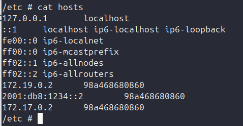

## /etc/hosts in Docker Container

> is configuration file => that maps `hostnames` ===> `IP address`

1. Add other hosts into container

```json
docker run --add-host my_hostname=8.8.8.8 -it ubuntu bash
```



## /etc/resolv.conf in Docker Container

> file defines the DNS servers => how container use that to resolve `hostnames` ===> `IP address`

1. Override dns

```json
docker run --dns 8.8.8.8 -it ubuntu bash
```

> when container try to resolve domain name ("example.com") => container will use `8.8.8.8` as DNS server


## Docker Built-in DNS vs Web-based DNS

1. Scope

- Built-in DNS: Local to Docker network
- Web-based DNS: Public internet

2. Use Cases

- Built-in DNS: Internal service discovery
- Web-based DNS: External service discovery

3. Isolation:

- Built-in DNS: Specific Isolation
- Web-based DNS: No Isolation

## Why should not use user-root in production environment

> By default, docker container run with root privileges

1. Root container offer:

- modify the container system: E.g: edit the host filesystem, install system packages...
- binding port

## How to allocate resources in docker

> By default, a container has no resource constraints

- On Linux hosts, if the kernel detects there isn't enough memory to perform important system functions => throw `OOME - Out of Memory Exception` => kills processes to free up memory => can bring the entire system down

> By default, each container's access to the host machine's CPU cycles is unlimited

```json
docker run --cpus="0.1" --memory="1g" -it ubuntu bash

// or

docker run --cpu-period=100.000 --cpu-quota=1.000.000 -it ubuntu bash

(100.000 microseconds ~ 100 milliseconds)
```

## Processing related to DNS in docker container


